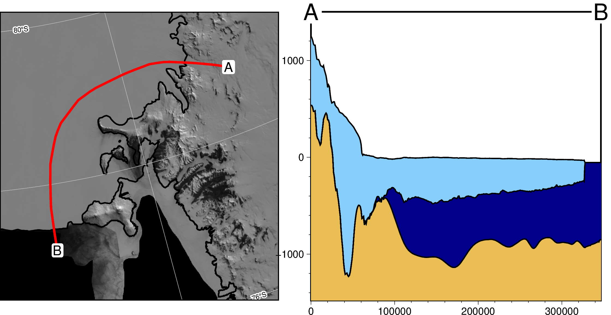

# Antarctic-plots
Functions to automate Antarctic data visualization

## Disclaimer

🚨 **This package is in early stages of design and implementation.** 🚨

I welcome any feedback, ideas, or contributions! Please submit an [issue on Github](https://github.com/mdtanker/antarctic_plots/issues) for problems or feature ideas. 

## About

This python package provides some basic tools for creating maps and plots specific to Antarctica. It includes code to download common continent-wide datasets (i.e. Bedmap2, AntGG, ADMAP), and visualize them in a variety of ways, including cross sections and maps. The Jupyter notebook [examples/examples.ipynb](https://github.com/mdtanker/antarctic_plots/blob/main/examples/examples.ipynb) runs through some of the main functions and usages of this package.

By default the cross-sections include Bedmap2 surface, icebase, and bed as layers, and the data profiles include Free-air gravity and magnetics, but these can be changed to any data, as long as it's supplied as a grid/raster type of file.

Data are sampled along lines either defined by 2 sets of coordinates, or along the path of a shapefile. 

Feel free to use, share, modify, and contribute to this project. I've mostly made this for private usage so for now the documentation is sparse. 
