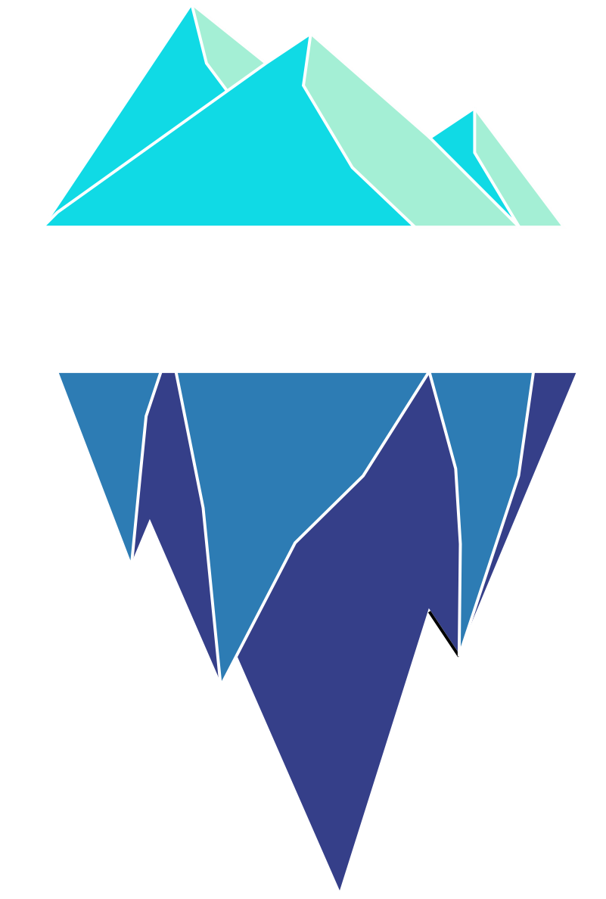
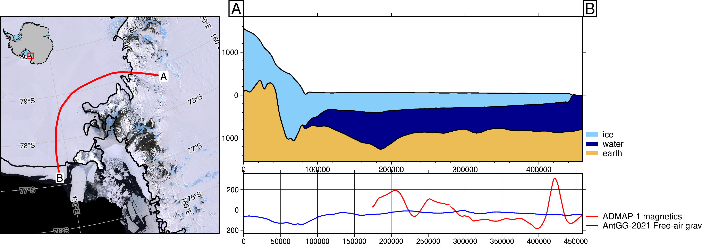

<h2 align="center">Helpful tools for polar researchers</h2>

<a href="https://polartoolkit.readthedocs.io"><strong>Documentation Link</strong></a>

<!-- SPHINX-START-proj-desc -->

**PolarToolkit** (formerly known as Antarctic-Plots) is a Python package to make polar (i.e. Antarctic, Arctic, Greenland) research more efficient, reproducible, and accessible.
The software does this by providing:

- convenient functions for downloading and pre-processing a wide range of commonly used polar datasets
- tools for common geospatial tasks (i.e. changing data resolution, subsetting data by geographic regions)
- code to easily create publication-quality maps, data profiles, and cross-sections
- a means to interactively explore datasets

<!-- SPHINX-END-proj-desc -->

<!-- SPHINX-START-badges -->

 

 

<!-- SPHINX-END-badges -->

# Disclaimer

🚨 **Ready for daily use but still changing.** 🚨

This means that we are still adding a lot of new features and sometimes we make changes to the ones we already have while we try to improve the software based on users' experience, test new ideas, make better design decisions, etc.
Some of these changes could be **backwards incompatible**.
Keep that in mind before you update PolarToolkit to a new major version (i.e. from `v1.0.0` to `v2.0.0`) and always check the [Changelog](https://github.com/mdtanker/polartoolkit/blob/main/CHANGELOG.md) for `BREAKING CHANGES` and how to update your code appropriately.

I welcome any feedback, ideas, or contributions!
Please contact us on the [GitHub discussions page](https://github.com/mdtanker/polartoolkit/discussions) or submit an [issue on GitHub](https://github.com/mdtanker/polartoolkit/issues) for problems or feature ideas.

<!-- SPHINX-START-long-desc -->

The **PolarToolkit** python package provides some basic tools to help in conducting polar research.
You can use it to download common datasets (i.e. BedMachine, Bedmap2, MODIS Mosaics), create maps and plots specific to Antarctica, Greenland and the Arctic and visualize data with multiple methods.

Feel free to use, share, modify, and [contribute](https://polartoolkit.readthedocs.io/en/latest/contributing.html) to this project.

## What _PolarToolkit_ is for:

- download commonly used datasets related to Antarctica, Greenland and the Arctic
- making publication-quality maps and cross-sections
- interactively explore data and define geographic regions
- plotting and working with data in projected coordinates (meters) in either EPSG 3031 or 3413, for the South and North hemispheres, respectively
- mostly focused on regularly gridded (interpolated) datasets, with some support for discrete (un-gridded) data
- current focus for datasets is related to ice, geophysics, and earth properties since this is where my personal research interests are, but please request or add your own types of data!
- basic geospatial manipulations (filtering, resampling, reprojecting, masking etc.)

## What _PolarToolkit_ is **NOT** for:

- downloading niche datasets or those that only cover specific regions
- downloaded datasets outside of Antarctica, Greenland and the Arctic
- plotting and working with data in geographic (latitude and longitude) coordinates
- plots not related to geospatial data
- a point-and-click GUI for plotting or data exploration -> see
  [Quantarctica](https://www.npolar.no/quantarctica/) or
  [QGreenland](https://qgreenland.org/)
- complex geospatial processing -> see
  [PyGMT](https://www.pygmt.org/dev/index.html),
  [Verde](https://www.fatiando.org/verde/dev/index.html),
  [Geopandas](https://geopandas.org/en/stable/) or
  [Rasterio](https://rasterio.readthedocs.io/en/stable/)

<!-- SPHINX-END-long-desc -->

# How to contribute
I welcome all forms of contribution! If you have any questions, comments or suggestions, please open a [discussion](https://github.com/mdtanker/polartoolkit/discussions/new/choose) or [issue (feature request)](https://github.com/mdtanker/polartoolkit/issues/new/choose)!

Also, please feel free to share how you're using PolarToolkit, I'd love to know.

Please, read our [Contributor Guide](https://polartoolkit.readthedocs.io/en/latest/contributing.html) to learn how you can contribute to the project.
