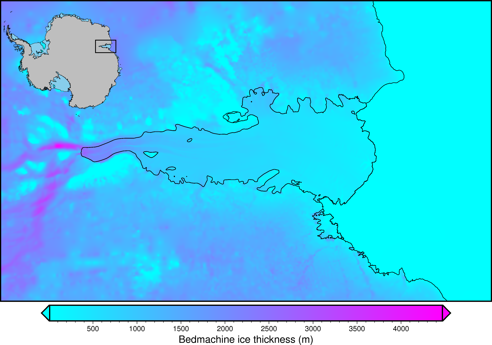
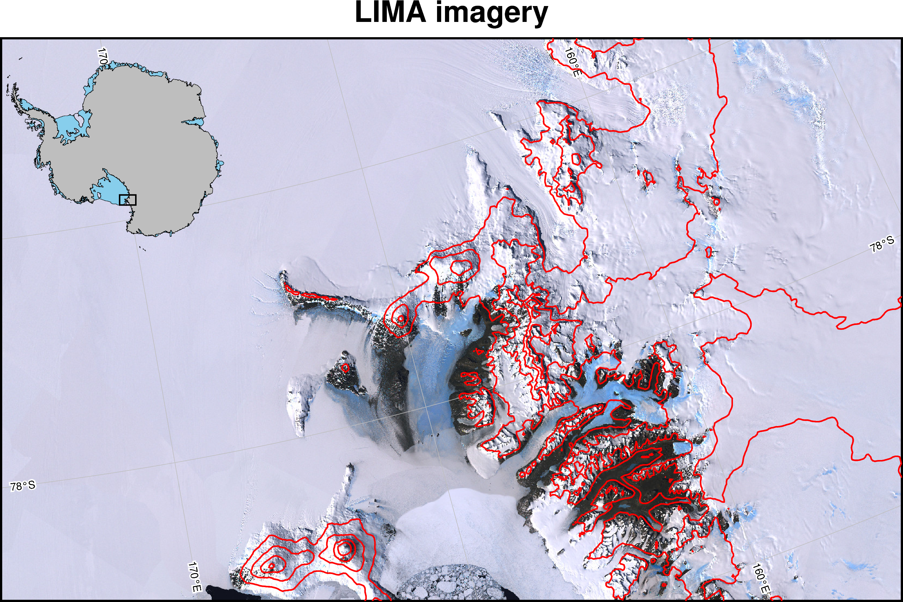
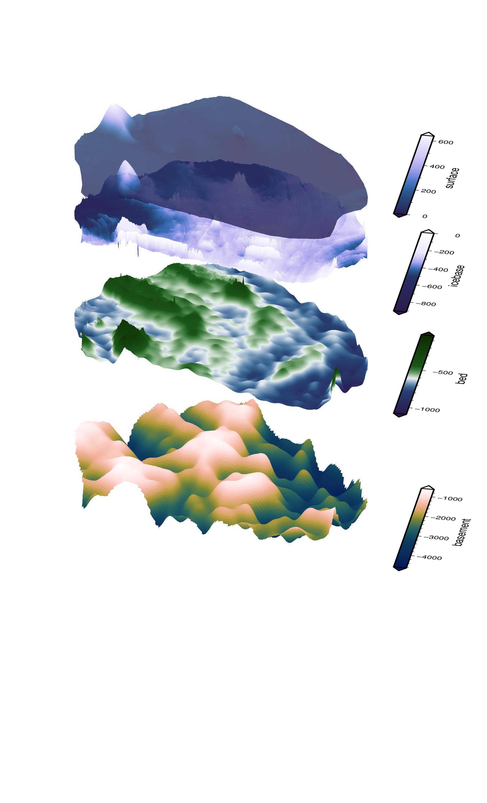
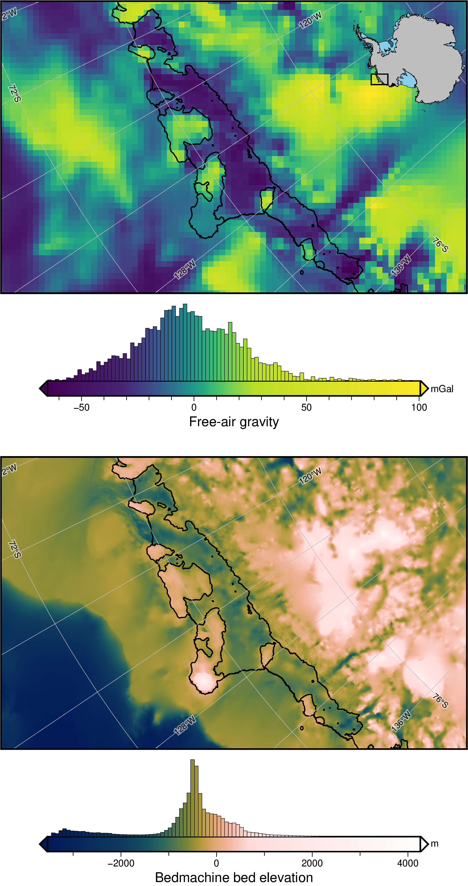
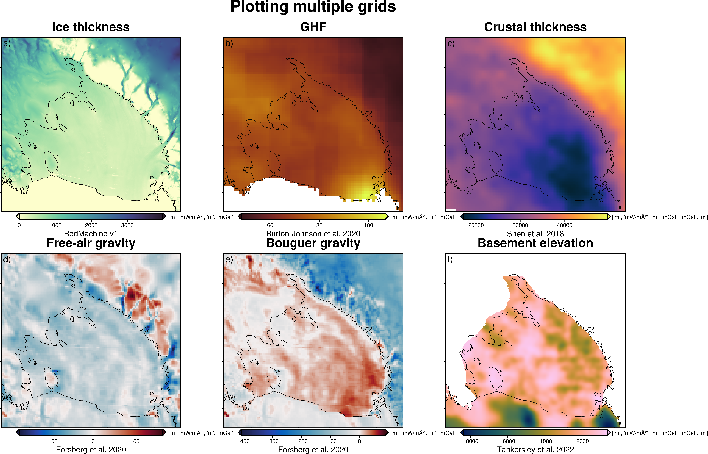
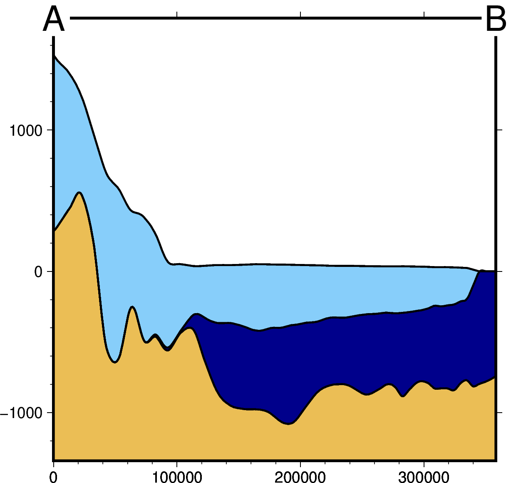
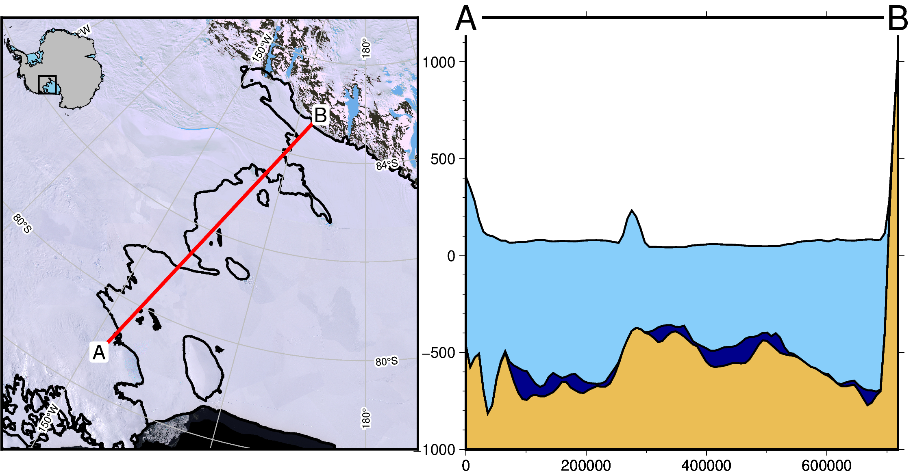
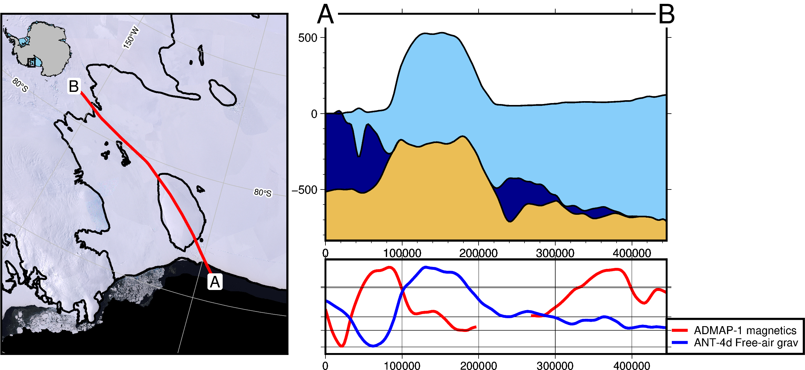
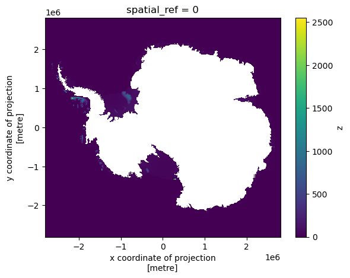

# Gallery

## Maps
[Basic map](basic_map.ipynb)                            | [Use with PyGMT](extend_pygmt.ipynb)
:------------------------------------------------------:|:-------------------------------------------------------:
                              | 

[Define projection](setting_projection.ipynb)           | [3D stack](3D_stack.ipynb)
:------------------------------------------------------:|:-------------------------------------------------------:
                     | 

[Create subplots](subplots.ipynb)                       | [Subplot layout](subplot_layout.ipynb)
:------------------------------------------------------:|:-------------------------------------------------------:
                               |

## Profiles
[Sample and plot profile](profile.ipynb)                | [Add map to profile](profile_with_map.ipynb)
:------------------------------------------------------:|:-------------------------------------------------------:
                                | 

[Add data to profile](profile_with_data.ipynb)          |
:-------------------------------------------------------:

## Utils
[Mask grids with shapefiles](mask_from_shp.ipynb)       |
:-------------------------------------------------------:
