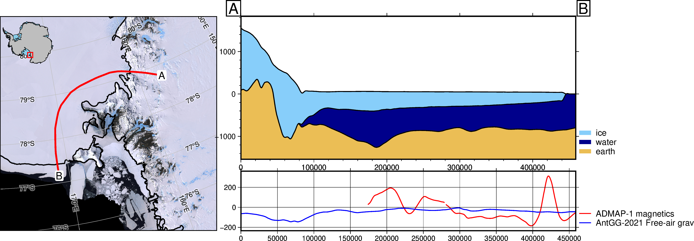

# Antarctic-plots

Functions to automate Antarctic data visualization

<p align="center">
<a href="https://mybinder.org/v2/gh/mdtanker/antarctic_plots/c88a23c9dfe92c36f0bfdbbc277d926c2de763de">
 </a>
 </p>

<p align="center">
<a href="https://pypi.org/project/antarctic-plots/"></a>
<a href="https://pypi.org/project/antarctic-plots/"></a>
<a href="https://zenodo.org/badge/latestdoi/475677039"></a>
<a href="https://antarctic-plots.readthedocs.io/en/latest/index.html"></a>
 </p>

 <p align="center">
 <a href=LICENSE></a>
 <a href="https://github.com/psf/black"></a>
<a href='https://readthedocs.org/projects/antarctic-plots/'></a>
<a href="https://codecov.io/gh/mdtanker/antarctic_plots" >
 </p>



## Disclaimer

<p align="center">
🚨 **This package is in early stages of design and implementation.** 🚨
 </p>

I welcome any feedback, ideas, or contributions! Please contact us on the [Github discussions page](https://github.com/mdtanker/antarctic_plots/discussions) or submit an [issue on Github](https://github.com/mdtanker/antarctic_plots/issues) for problems or feature ideas.

## About

The **Antarctic-plots** python package provides some basic tools to help in conducting Antarctic research. You can use it to download common datasets (i.e. BedMachine, Bedmap2, MODIA MoA), create maps and plots specific to Antarctica, and visualize data with multiple methods. 

Check out our [Documentation](https://antarctic-plots.readthedocs.io/en/latest/) for instructions on installing and using the package.

Feel free to use, share, modify, and [contribute](https://antarctic-plots.readthedocs.io/en/latest/contribute.html) to this project. I've mostly made this for personal usage so expect significant changes. Hopefully I'll implement more tests and Gallery examples soon.

## Project goals

Below is a list of some features I hope to eventually include. Feel free to make a feature request through [Github Issues](https://github.com/mdtanker/antarctic_plots/issues/new/choose).

* Create 3D interactive models to help visualize data.
* Include more Antarctic datasets to aid in download and storage.
* Additional projections and possible support for the Arctic region as well.

```{tableofcontents}
```
