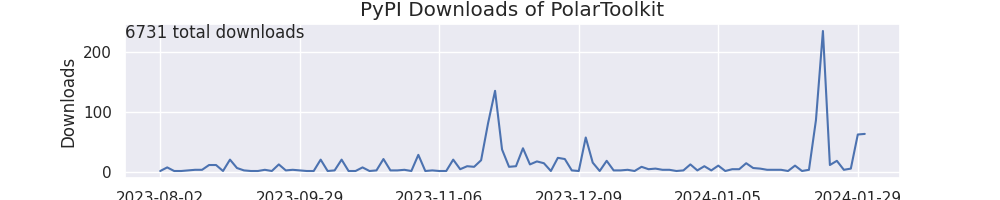

## PyPI Downloads

Non-mirrored downloads of polartoolkit from the `Python Package Index <https://pypi.org/>`_ (e.g. using `pip install polartoolkit`).

## GitHub Traffic
The GitHub repository has automatic tracking of cloning and traffic to the repo website, which can be found [here](https://github.com/mdtanker/polartoolkit/graphs/traffic).

## Documentation Views

