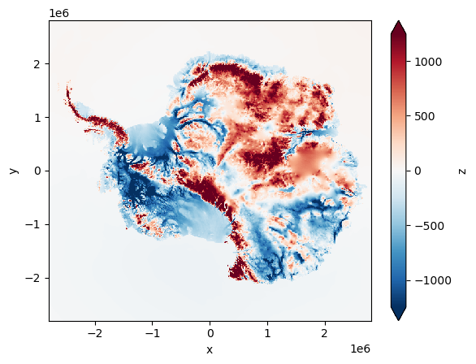
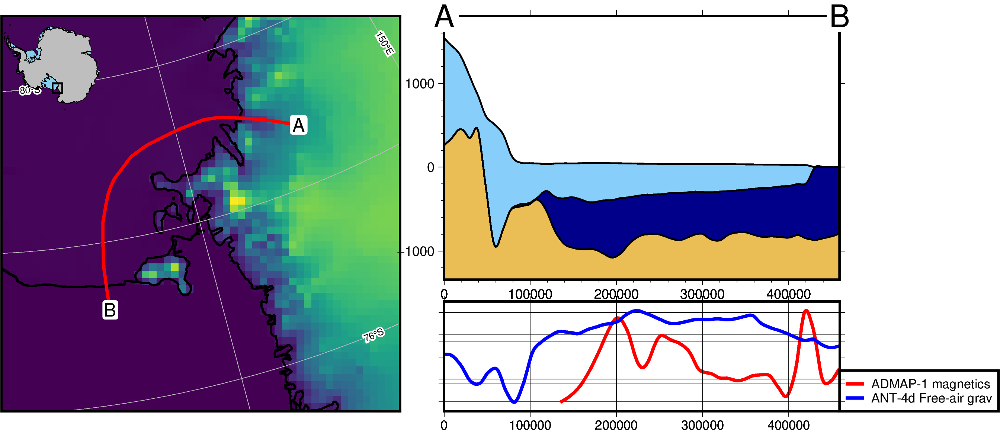
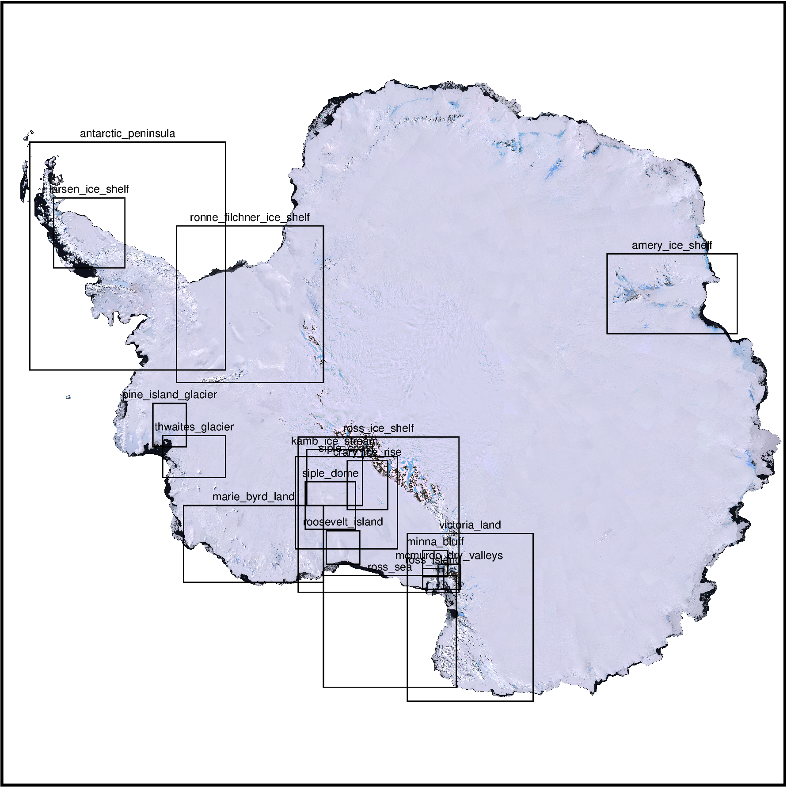
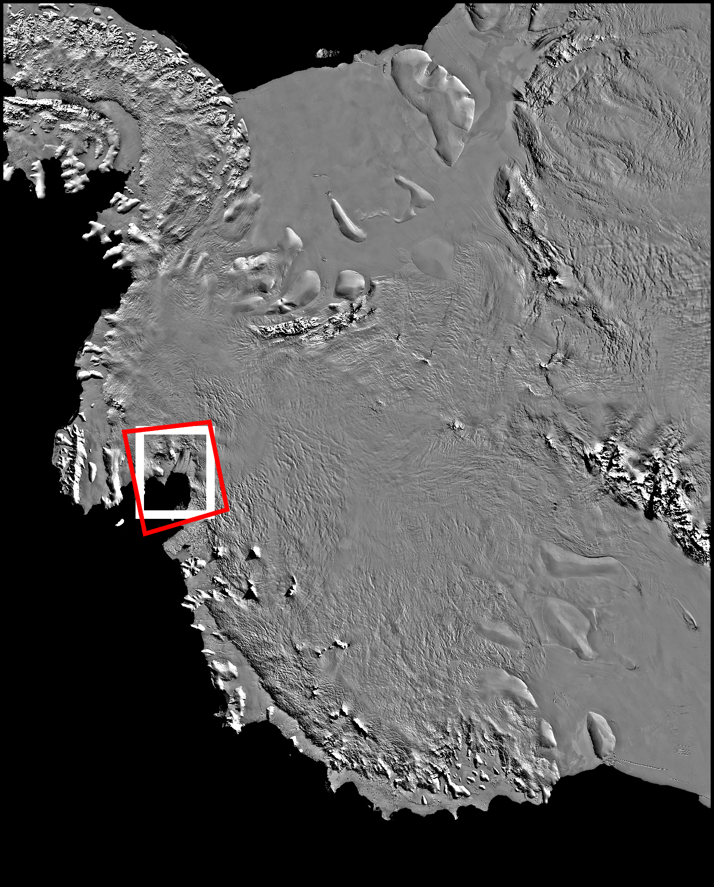

# Tutorials

[Fetching datasets](fetch_walkthrough.ipynb)
-----------------------------------

[Creating profiles and cross sections](profile_walkthrough.ipynb)
-----------------------------------

[Pre-defined regions](regions_walkthrough.ipynb)
-----------------------------------

[Useful functions](utils_walkthrough.ipynb)
-----------------------------------
