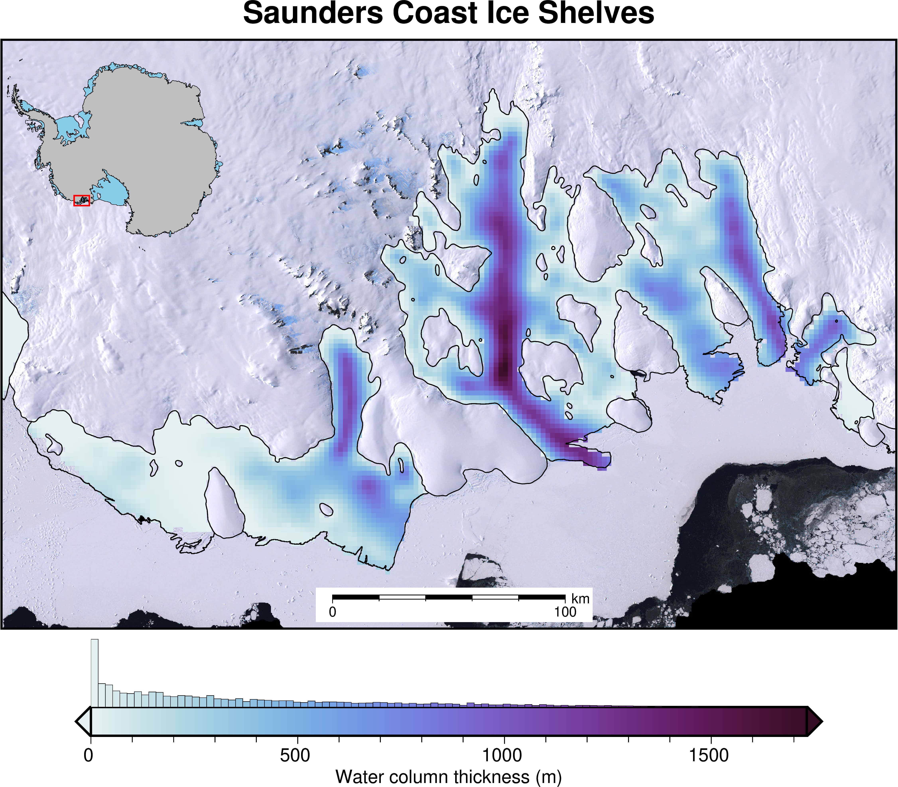

<!--
Title options:
PolarToolkit: Helping Polar Researchers Conduct Science
PolarToolkit: A Python Package for Polar Science
PolarToolkit: Python Tools for Conducting Polar Science
Cryospheric Insights Made Easy: Exploring PolarToolkit for Polar Studies
PolarToolkit: A Comprehensive Software Suite for Antarctic Research
PolarToolkit: Software for Cryospheric Mapping, Analysis, and Data Retrieval
PolarToolkit: Software to Aide in Cryospheric Research
PolarToolkit: Facilitating Cryospheric Research with Open-Source Software

-->

<!--
Typically 250-1000 words
Your paper should include:

A list of the authors of the software and their affiliations, using the correct format (see the example below).

A summary describing the high-level functionality and purpose of the software for a diverse, non-specialist audience.

A Statement of need section that clearly illustrates the research purpose of the software and places it in the context of related work.

A list of key references, including to other software addressing related needs. Note that the references should include full names of venues, e.g., journals and conferences, not abbreviations only understood in the context of a specific discipline.

Mention (if applicable) a representative set of past or ongoing research projects using the software and recent scholarly publications enabled by it.

Acknowledgement of any financial support.
-->
# Summary \hfill { width=15% } \hfill \phantom{Summary}
<!-- describing the high-level functionality and purpose of the software for a diverse, non-specialist audience. -->
**PolarToolkit** (formerly known as Antarctic-Plots) is a Python package with the goal of making Polar (i.e. Antarctic, Arctic, Greenland) research more efficient, reproducible, and accessible.
The software does this by providing; 1) convenient functions for downloading and pre-processing a wide range of commonly used polar datasets, 2) tools for common geospatial tasks (i.e. changing data resolution, subsetting data by geographic regions), and 3) code to easily create publication-quality maps, data profiles, and cross-sections.
Additionally, `PolarToolkit` provides an easy means for exploring datasets with pre-defined or interactively-chosen geographic regions.

# Statement of need
<!-- clearly illustrates the research purpose of the software and places it in the context of related work. -->
A common workflow for a geospatial scientist might be: navigate to an online repository and download a dataset, place this downloaded file in a local folder on their computer, perform some preprocessing steps, such a re-projecting, or interpolating the data, possibly using tools like GMT [@wesselgeneric2019], perform their scientific analysis on the data, and then create a map with this data using a graphical user interface (GUI) application such as QGIS [@qgisdevelopmentteamqgis2024].
These workflows typically require many separate tools (i.e. internet browser, file browser, spatial analysis software, and mapping software), and are often manually repeated many times throughout a manuscript revision process, and throughout the career of the scientist.

`PolarToolkit` aims to consolidate this workflow to be entirely contained within Python, making it both easier and faster to perform all these steps.
Scripting workflows like this has several advantages: 1) it decreases the chance of human errors, for example using an old-version of the downloaded data or accidentally altering a pre-processing steps, such as referencing a raster of elevation data to the geoid instead of the ellipsoid, and 2) it allows entire workflows to be shared easily between collaborators with a single python file or Jupyter Notebook.
Although a popular and well-designed similar package exists [Antarctic Mapping Tools, @greeneantarctic2017], PolarToolkit is unique in its open-access without the need for a paid MatLab license.

Written in easy-to-learn Python, and utilizing common geospatial data structures, `PolarToolkit` is designed to be familiar to use for experienced Python users, while also being approachable for beginner coders.
It is built upon several open-source packages, such a [Pooch](https://www.fatiando.org/pooch/latest/) for data downloading [@uiedapooch2020], [PyGMT](https://www.pygmt.org/latest/) for creating figures [@uiedapygmt2021], and [xarray](https://docs.xarray.dev/en/stable/) and [verde](https://www.fatiando.org/verde/latest/) for geospatial data processing [@hoyerxarray2017; @uiedaverde2018].

Comprehensive documentation, API reference, tutorials and how-to guides are available at [https://antarctic-plots.readthedocs.io/en/](https://antarctic-plots.readthedocs.io/en/), and development occurs in the [GitHub repository](https://github.com/mdtanker/polartoolkit).


# PolarToolkit Modules
The key functionality of `PolarToolkit` is organized into five modules:

| Module      | Description                                                                   |
| ----------- | ----------------------------------------------------------------------------- |
| **regions** | Pre-defined or interactively chosen geographic regions                        |
| **fetch**   | Functions to download, pre-process, and retrieve cached data                  |
| **maps**    | Create high-quality maps with functions specifically tailored to polar settings |
| **profile** | Define a line, sample layers and data along it, and plot the results          |
| **utils**   | Useful functions for common tasks (e.g. coordinate conversion, masking)       |

# Example
The below example demonstrates the functionality of `PolarToolkit`. Running the code will perform the following steps:

1) Download (or retrieve previously downloaded) datasets from various online repositories:
  * Surface and bed elevation, and ice thickness data from Bedmap2 [@fretwellbedmap22013]
  * Antarctic coastline and groundingline shapefiles [@depoorterantarctic2013]
  * Antarctic ice shelf boundary shapefiles [@mouginotmeasures2017]
  * Imagery data from LIMA [@bindschadlerlandsat2008]
2) Pre-process the data
  * convert the Bedmap2 `.tif` files into compressed `.zarr` files
  * resample the grid resolutions from 1 km to 2 km
  * extract the portion of the grids around the Saunders Coast region
  * calculate the water column thickness ([surface - ice thickness] - bed)
  * mask the grid outside of the floating ice shelves
3) Create a map
  * plot a basemap of imagery
  * plot water column thickness data
  * add a colorbar histogram to show data distribution
  * add features like a scale bar, inset map and a title

```python
# import modules
from polartoolkit import regions, fetch, utils, maps

# define a region
region = regions.saunders_coast

# download and pre-process bedmap2 data
water_thickness = fetch.bedmap2(
  layer="water_thickness",
  region=region,
  spacing=2000)

# mask areas outside of ice shelves
water_thickness = utils.mask_from_shp(
    shapefile=fetch.measures_boundaries(version="IceShelf"),
    xr_grid=water_thickness,
    masked=True,
    invert=False)

# plot map and set options
fig = maps.plot_grd(
    grid=water_thickness, 
    cmap="dense",
    title="Saunders Coast Ice Shelves",
    cbar_label="Water column thickness (m)",
    imagery_basemap=True,
    coast=True,
    inset=True,
    scalebar=True,
    hist=True)

# display figure
fig.show()
```

![Example map output from above code implemented in `PolarToolkit`. Water column thickness [@fretwellbedmap22013] beneath the ice shelves of Antarctica's Saunders Coast. Inset map shows figure location. Grounding line and coastlines shown by black line [@depoorterantarctic2013]. Background imagery from LIMA [@bindschadlerlandsat2008]. Colorbar histogram shows data distribution.](example_figure.png){ width=70% }

# Acknowledgements
I would like to acknowledge the support in the early stages of this project from Wei Ji Leong, who taught me many of the skills necessary for developing this package, as well as the team at PyGMT, Fatiando a Terra, and the community of Software Underground for all the technical support and providing open-source software which inspired this project.

# References

<!-- \newpage

\Begin{multicols}{2}

```python
from polartoolkit import fetch, regions, maps, utils

# define a region
region = regions.ronne_filchner_ice_shelf

# download bedmap2 data and calculate water column thickness
water_thickness = fetch.bedmap2(
    layer="water_thickness",
    region=region,
)

# mask to ice shelf areas
water_thickness = utils.mask_from_shp(
    fetch.measures_boundaries(version="IceShelf"),
    xr_grid=water_thickness,
    masked=True,
    invert=False,
)

# plot map and set options
fig = maps.plot_grd(
    water_thickness,
    cmap="dense",
    grd2cpt=True,
    title="Ronne-Filchner Ice Shelf",
    cbar_label="Ocean cavity thickness (m)",
    imagery_basemap=True,
    coast=True,
    inset=True,
    scalebar=True,
    hist=True,
    add_faults=True,
)

# add legend
fig.legend()

# display figure
fig.show()
```
\End{multicols}



\newpage -->


<!--
```python
from polartoolkit import fetch, regions, maps
# define a region
region = regions.amery_ice_shelf
# download Bedmap2 ice thickness data
ice_thickness = fetch.bedmap2(
    layer="thickness",
    region=region,
    spacing=2000,
)

# plot map and set options
fig = maps.plot_grd(
    ice_thickness,  # input data
    cmap="dense",  # set the colormap
    coast=True,  # plot grounding and coastlines
    title="Amery Ice Shelf",  # add title
    cbar_label="Ice thickness (m)",  # add label
    inset=True,  # add inset map
    scalebar=True,  # add scalebar
    gridlines=True,  # add lat/lon gridlines
    x_spacing=10, # lon interval (deg)
    hist=True,  # add a histogram to the colorbar
)
# display figure
fig.show()
```
-->


<!--
+----------------------------------------------+--------------------------------------+
|```python                                     |```python                             |
|# define a region                             |# plot map and set options            |
|region = regions.amery_ice_shelf              |fig = maps.plot_grd(                  |
|                                              |    ice_thickness,                    |
|# download Bedmap2 ice thickness data         |    cmap="dense",                     |
|ice_thickness = fetch.bedmap2(                |    coast=True,                       |
|    layer="thickness",                        |    title="Amery Ice Shelf",          |
|    region=region,                            |    cbar_label="Ice thickness (m)",   |
|    spacing=2000,                             |    inset=True,                       |
|)                                             |    scalebar=True,                    |
|```                                           |    gridlines=True,                   |
|                                              |    x_spacing=10,                     |
|                                              |    hist=True,                        |
|                                              |)                                     |
|                                              |# display figure                      |
|                                              |fig.show()                            |
|                                              |```                                   |
+----------------------------------------------+--------------------------------------+
-->

<!--
+--------------------------------------+-------------------------+
|```python                             |                         |
|# define a region                     |                         |
|region = regions.amery_ice_shelf      |                         |
|# download Bedmap2 ice thickness data |                         |
|ice_thickness = fetch.bedmap2(        |                         |
|    layer="thickness",                |                         |
|    region=region,                    |                         |
|    spacing=2000,                     |                         |
|)                                     |                         |
|# plot map and set options            | |
|fig = maps.plot_grd(                  |                         |
|    ice_thickness,                    |                         |
|    cmap="dense",                     |                         |
|    coast=True,                       |                         |
|    title="Amery Ice Shelf",          |                         |
|    cbar_label="Ice thickness (m)",   |                         |
|    inset=True,                       |                         |
|    scalebar=True,                    |                         |
|    gridlines=True,                   |                         |
|    x_spacing=10,                     |                         |
|    hist=True,                        |                         |
|)                                     |                         |
|# display figure                      |                         |
|fig.show()                            |                         |
|```                                   |                         |
+--------------------------------------+-------------------------+
-->
